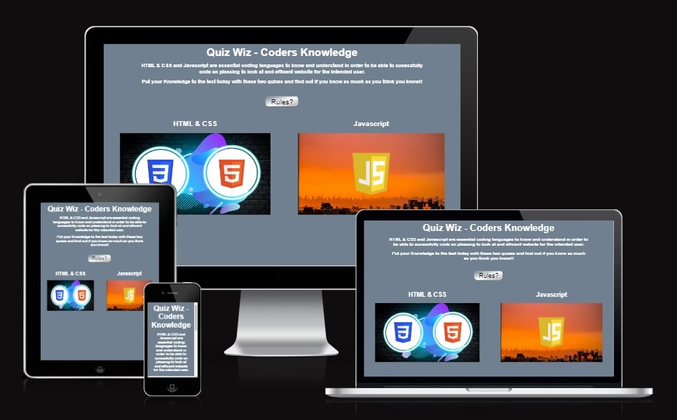
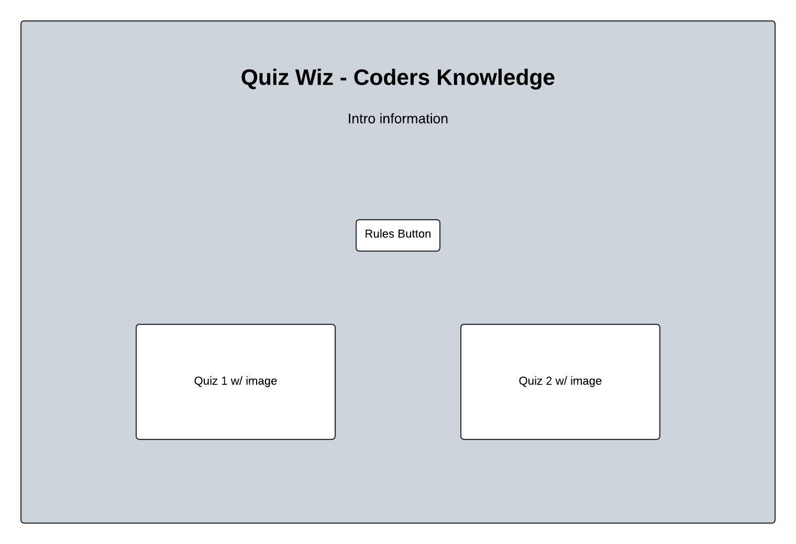
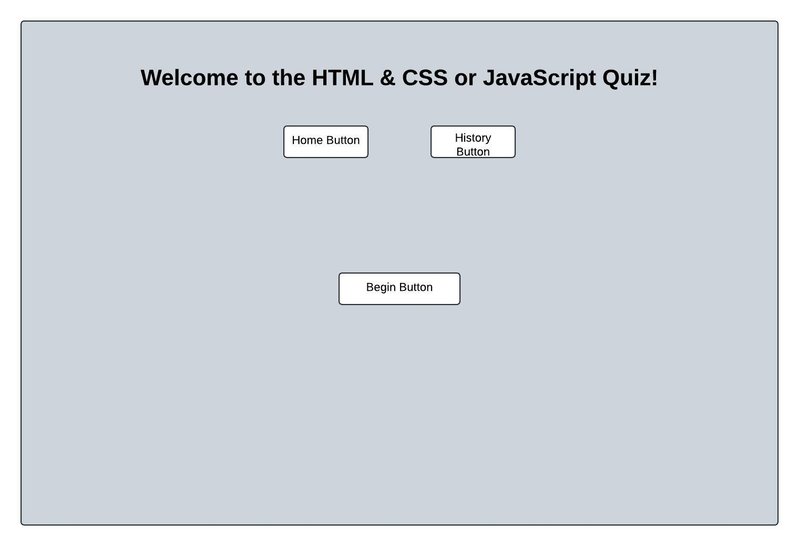
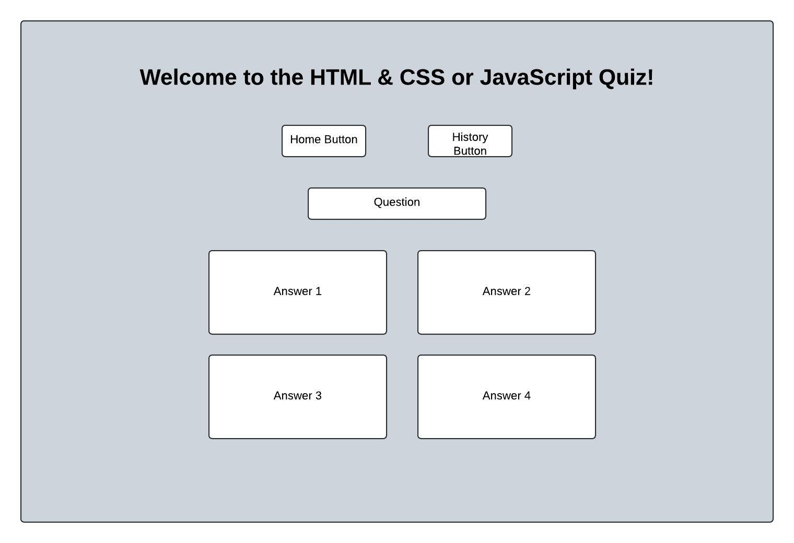

## HTML & CSS and Javascript coding quiz
### By Denis Berrill

## -[Live Site](https://precursorr.github.io/Quiz---Project-Portfolio-2/index.html)

## Overview 
For this project I decided to make a simple coding quiz to test the knowledge of aspiriring coders while also showing them where they might be struggling on these topics. 
After conteplating which topics I wanted to cover I decided to pair HTML & CSS together while leaving JavaScript as a stand alone quiz. 
My goal was to have 10 questions per quiz with a score counter keeping track of the correct answers out of the possible 10. 
At the end of the quiz the user would be shown the results, indicating which ones they had gotten incorrect.

## Style & Layout
I wanted to keep the style simple while easy to read. The colors were chosen because they contrasted well against each other while also not bombaring the users eyes, the colorful images instead drawing the user immediately to the quiz.

The layout was to be simple with 3 pages:
 - The Homepage
 - HTML & CSS Quiz Page
 - JavaScript Page

### The Homepage
For the homepage I wanted to have a a heading with a simple intro for the users, a rules button to pop up the rules of the quiz and 2 options for the user to choose, 1 for each quiz. 

### HTML & CSS and Javascript Quiz intro Page (Before beginning quiz)
The quiz pages were to have again a heading with 3 buttons, 2 of which directly below the heading. 1 for returning back to the homepage and one that poped up a window outlining the brief early history of that coding language with a link at the end to forward the user to the respective site with more information to learn. Below those 2 buttons is the begin button.

### HTML & CSS and Javascript Quiz Page (After beginning quiz)
Upon clicking begin, that button would disappear while the quiz section itself appeard on the screen. The first question would already be presented to the user and after each answer was given, the next question would appear. The user would be given 4 choices to answer in a grid like boxed format.

